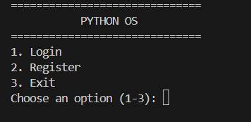
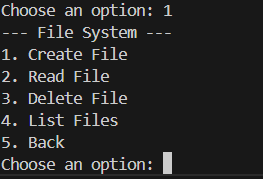
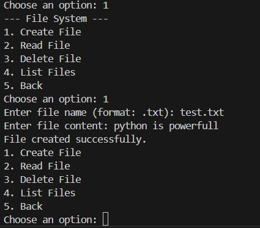
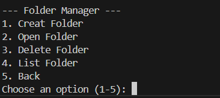
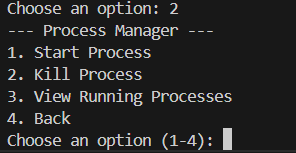
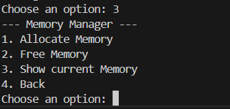
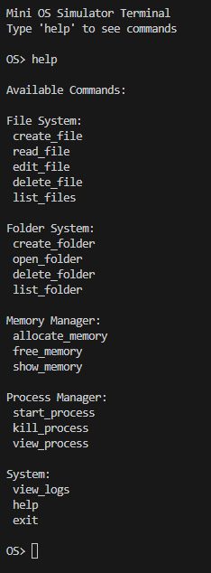
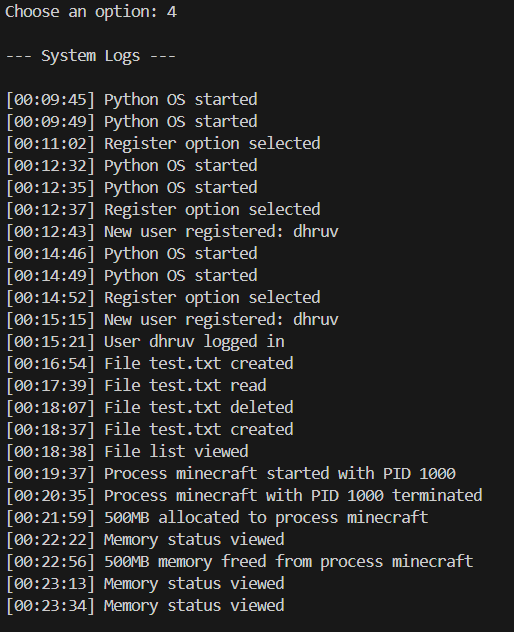

# Python OS Simulator

A terminal-based operating system simulator built with **pure Python**.
This project demonstrates core programming concepts such as **Object-Oriented Programming, file handling, system simulation, and modular architecture** without relying on external frameworks.

The simulator mimics basic operating system components including **user authentication, file management, process handling, and memory simulation**.

---

## Overview

The goal of this project is to simulate how a simple operating system manages different subsystems.
Instead of focusing on UI or frameworks, the emphasis is on **core logic, system design, and clean code structure**.

This project was built as a learning exercise to strengthen understanding of:

* Python fundamentals
* OOP design
* Modular programming
* State management
* File-based persistence

---

## Overview

The goal of this project is to simulate how a simple operating system manages different subsystems.

---

## Screenshots

### System Start


### Main Menu


### File System


### Folder Manager


### Process Manager


### Memory Manager


### Terminal 


### System Logs



## Features

* **User Authentication**

  * Register and login system
  * Persistent user storage

* **File System Simulation**

  * Create virtual files
  * Read stored file content
  * Delete files
  * List available files

* **Process Manager**

  * Simulate running processes
  * Assign process IDs (PID)
  * View active processes
  * Terminate processes

* **Memory Manager**

  * Simulate memory allocation
  * Track used and free memory
  * Deallocate memory

* **Create Folder**

  * Create folder
  * Open fodler
  * Delete fodler
  * List folder

* **System Logging**

  * Track important system events
  * User login activity
  * File operations
  * Process actions

---

## Project Structure

```
python-os-simulator/
│
├── core/
│   ├── cmd.py
│   ├── file_system.py
│   ├── folder.py
│   ├── logger.py
│   ├── Main.py
│   ├── memory.py
│   ├── pos.py
│   ├── process.py
│
├── data/
│   │ └── files/
│   └── player/
│         └─ main.py
│   ├── files.json
│   ├── logs.txt
│   ├── test.txt
│   └── users.txt
│
│
├── screenshots
│
├── .gitattributes
├── .gitignore
├──  LICENSE
└── README.md
```

Each module is responsible for a specific subsystem of the simulated OS.

---

## How It Works

When the program starts, users are presented with a login/register interface.
After authentication, the main system menu allows interaction with various simulated OS components.

The simulator uses **file-based storage** to persist data between sessions.

---

## Example Usage

```
====================================
        PYTHON OS
====================================

1. Login
2. Register
3. Exit

Enter choice: 1

Login successful!

Main Menu
1. File System
2. Creat Folder
3. Process Manager
4. Memory Manager
5. View Logs
6. Terminal
7. Logout
```

---

## Technologies Used

* Python 3
* Object-Oriented Programming
* File Handling
* JSON / Text Storage

No external libraries or frameworks were used.

---

---

## Changelog

### v1.2.0

New Features
- Added terminal commands (about, uptime, system_info)
- Improved command terminal usability

Improvements
- Better system interaction through command interface

### v1.1.0
- Introduced Folder Manager (create, open, delete folders)
- Enabled file creation inside folders
- Improved modular interaction between folder and file system
- Stability improvements and bug fixes

### v1.0.1
- Fixed login validation
- Fixed process manager edge case
- Improved memory manager safety

### v1.0.0
- Initial release
- File system
- Process manager
- Memory manager
- Logging

---

Project Stats

~1600+ lines of Python code  
8 modular components  
Terminal-based OS simulation

## Author

Dhruv

Python Developer | Exploring System Design
GitHub: https://github.com/Dhruv-Cmds
